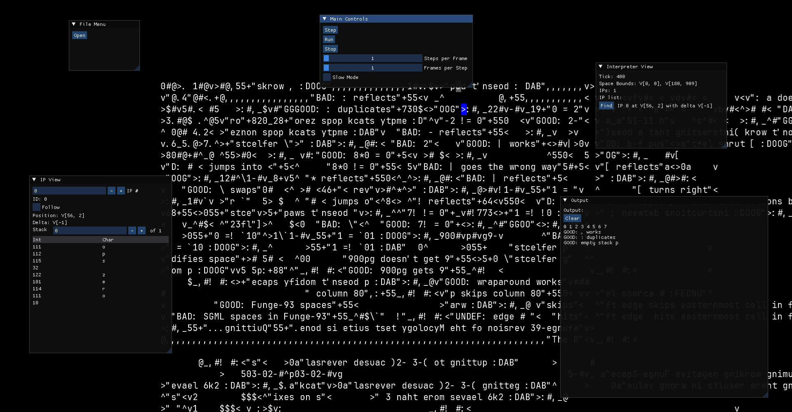

# ReFunge

ReFunge is a mostly spec-compliant Funge-98 interpreter written in C#.
It can be used as a library or as a standalone program.

Also included in this repository is ReFunge Editor, a simple editor and debugger for Funge-98 programs. 
It lets you view Funge-Space, IP and stack data, and other useful variables during execution.

## Features

- Support for the core Funge-98 language
- File I/O and concurrency are supported
- Currently supported fingerprints:
  - All those defined in the official specification, except for `PERL` and `WIND`
  - `LONG`, `FPSP`, `FPDP`, `CPLI`, `3DSP`, `BASE`
  - More to come!
- Supports arbitrary n-dimensional Euclidean Funges (with Lahey-space wrapping).
- ReFunge Editor:
  - Load and debug Befunge-98 programs
  - View Funge-space, IP, stack, output, and other variables
  - Step through the program or execute it at a set speed (up to 100 instructions per frame)
  - Edit the program, even during execution.
    - Note: Rewinding the program to its initial state is not yet supported.
  - Rotate the Funge-space to view it from different angles!
    - Ctrl-U and Ctrl-O rotate around the axis perpendicular to the screen (Befunge or higher)
    - Ctrl-J and Ctrl-L rotate around the axis going down (Trefunge or higher)
    - Ctrl-I and Ctrl-K rotate around the axis going right (Trefunge or higher)

Breakpoints are planned for the future.

## Usage

Will be added soon.
